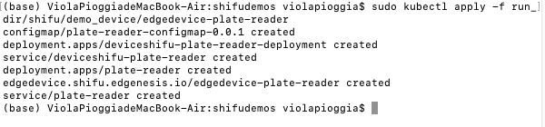

# Shifu_demo
在Kubernetes中运行Shifu并编写一个应用的实践过程


## 部署并运行 Shifu

```sh
sudo docker ps
```


Shifu 安装已完成

```
sudo kubectl get pods -A
```


## 运行一个酶标仪的数字孪生

### 准备


### 运行

```sh
sudo kubectl apply -f run_dir/shifu/demo_device/edgedevice-plate-reader
```



```sh
sudo kubectl get pods -A | grep plate
```

成功启动


### 交互

进入 nginx


```
curl "deviceshifu-plate-reader.deviceshifu.svc.cluster.local/get_measurement"
```


## 编写一个 Go 程序

编写代码

```go
package main

import (
	"io/ioutil"
	"log"
	"net/http"
	"time"
)

func main() {
	targetUrl := "http://deviceshifu-plate-reader.deviceshifu.svc.cluster.local/get_measurement"
	req, _ := http.NewRequest("GET", targetUrl, nil)
	for {
		res, _ := http.DefaultClient.Do(req)
		body, _ := ioutil.ReadAll(res.Body)
		average := calculateAverage(body)
		log.Println("Average:", average)
		time.Sleep(2 * time.Second)
	}
}

func calculateAverage(data []byte) float64 {
	sum := 0
	count := 0
	for _, value := range data {
		sum += int(value)
		count++
	}
	if count > 0 {
		return float64(sum) / float64(count)
	}
	return 0
}

```

docker 打包


将应用镜像加载到 `kind` 中


运行容器 Pod


成功运行


### 检查应用输出

每两秒打印一次切片的值，符合程序预期


